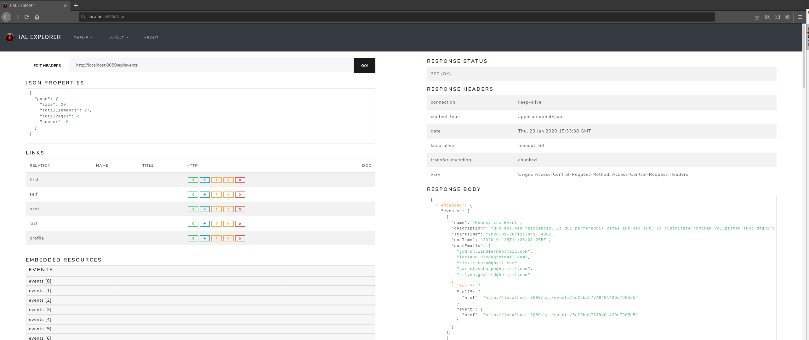

# Sample Spring Data Rest API

A sample project that illustrates how to create a rest api using [Spring Data Rest](https://spring.io/projects/spring-data-rest)

## Getting Started

## Usage

`>> mvn spring-boot:run`

### Reference Documentation
For further reference, please consider the following sections:

* [Official Apache Maven documentation](https://maven.apache.org/guides/index.html)
* [Spring Boot Maven Plugin Reference Guide](https://docs.spring.io/spring-boot/docs/2.2.3.RELEASE/maven-plugin/)
* [Rest Repositories](https://docs.spring.io/spring-boot/docs/2.2.4.RELEASE/reference/htmlsingle/#howto-use-exposing-spring-data-repositories-rest-endpoint)
* [Spring Data MongoDB](https://docs.spring.io/spring-boot/docs/2.2.3.RELEASE/reference/htmlsingle/#boot-features-mongodb)
* [Spring Boot Actuator](https://docs.spring.io/spring-boot/docs/2.2.3.RELEASE/reference/htmlsingle/#production-ready)